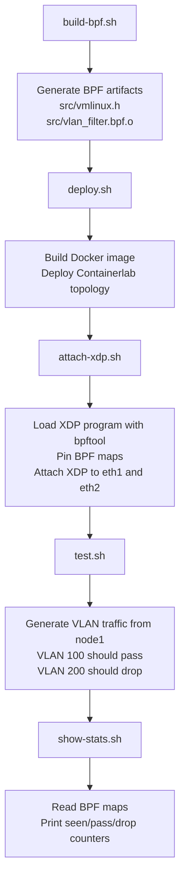
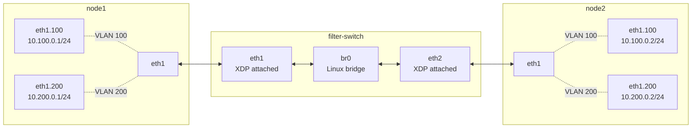
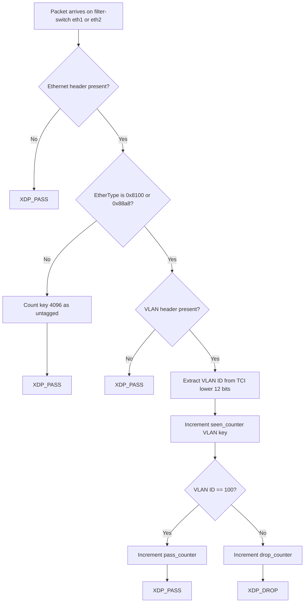
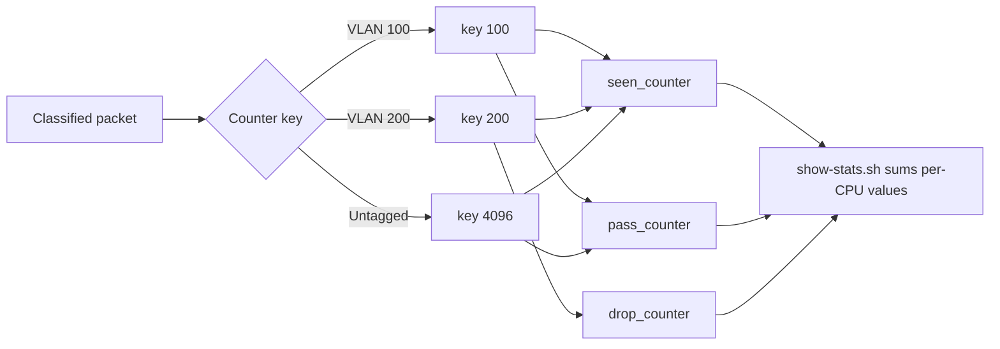

# XDP/eBPF VLAN Tag Filter

This repository contains a Containerlab-based networking project that implements an XDP/eBPF VLAN tag filter. The filter runs on a Linux `filter-switch` node, inspects Ethernet frames at XDP hook points, allows VLAN 100, drops VLAN 200 and other tagged VLANs, passes untagged traffic, and records packet counters in BPF maps.

The project was validated in a VBox Ubuntu 24.04 environment. WSL is used only for editing, Git, cleanup, and documentation.

## Project Overview

The lab uses three Linux containers connected with Containerlab: `node1`, `filter-switch`, and `node2`. The two end hosts have VLAN subinterfaces for VLAN 100 and VLAN 200. The middle node bridges the two links and runs the XDP program on both bridge-facing interfaces, `eth1` and `eth2`.

The XDP program reads each packet before normal Linux bridge forwarding. It parses the Ethernet header, detects 802.1Q or 802.1AD VLAN tags, extracts the VLAN ID, applies a static policy, and updates per-VLAN counters. This provides both packet filtering and visibility into how many packets were seen, passed, or dropped.

## Key Results

| Requirement | Result |
|---|---|
| VLAN 100 forwarding | Passed |
| VLAN 200 filtering | Dropped |
| Untagged traffic | Passed |
| Per-VLAN counters | Working |
| XDP attachment | Verified on `filter-switch:eth1` and `filter-switch:eth2` |

## Implemented Requirements

| Level | Status | Description |
|---|---:|---|
| Basic | Completed | Static VLAN filtering with VLAN 100 allowed and VLAN 200 dropped. |
| Intermediate | Completed | Per-VLAN packet statistics using BPF maps. |
| Advanced | Future work | Dynamic policy changes from user space are intentionally not implemented in this submission. |

## Prerequisites

The validated environment was VBox Ubuntu 24.04 with:

| Requirement | Reason |
|---|---|
| Linux environment with BPF support | Required for XDP and BPF maps. |
| Docker | Runs the lab containers and BPF build container. |
| Containerlab | Creates the virtual topology. |
| `bpftool` | Loads programs, pins maps, inspects XDP attachment, and reads counters. |
| clang/LLVM or provided build helper | Compiles BPF C source into BPF object files. |
| Privileged/container networking support | Required for interfaces, bridges, VLANs, and XDP attach. |

WSL is suitable for editing and Git operations, but the runtime workflow should be executed in the Linux validation environment.

## How to Run

A clean checkout should first build the BPF object from the repository root in the VBox Ubuntu environment:

```bash
./scripts/build-bpf.sh
```

Then run the validated workflow:

```bash
./scripts/deploy.sh
./scripts/attach-xdp.sh
./scripts/test.sh
./scripts/show-stats.sh
```

Step details:

| Step | What it does | Success means |
|---|---|---|
| `deploy.sh` | Builds the lab image and starts the Containerlab topology. | `node1`, `filter-switch`, and `node2` are running. |
| `attach-xdp.sh` | Loads the XDP program and attaches it to `filter-switch` `eth1` and `eth2`. | `bpftool net` shows XDP attached on both ports. |
| `test.sh` | Sends VLAN 100 and VLAN 200 pings from `node1` to `node2`. | VLAN 100 succeeds; VLAN 200 fails. |
| `show-stats.sh` | Reads BPF maps and prints counter totals. | VLAN counters match the expected pass/drop policy. |

## Execution Workflow

The project is executed in stages. Each script prepares one part of the lab lifecycle, from building the BPF object to validating the VLAN policy.



---

### Workflow Summary

| Step | Script | What Happens |
|------|--------|--------------|
| 1 | `build-bpf.sh` | Generates `src/vmlinux.h` and compiles `src/vlan_filter.bpf.c` into `src/vlan_filter.bpf.o`. |
| 2 | `deploy.sh` | Builds the lab Docker image and deploys the Containerlab topology. |
| 3 | `attach-xdp.sh` | Loads the BPF object, pins maps under `/sys/fs/bpf`, and attaches XDP to `filter-switch:eth1` and `filter-switch:eth2`. |
| 4 | `test.sh` | Sends test traffic from `node1` to `node2` on VLAN 100 and VLAN 200. |
| 5 | `show-stats.sh` | Reads the pinned BPF maps and prints per-VLAN seen/pass/drop counters. |
| 6 | `destroy.sh` | Destroys the Containerlab topology and removes the lab Docker image when testing is finished. |

---

## Packet Processing Path

During testing, the main packet path is:

```text
node1 VLAN subinterface
        |
        v
node1 eth1
        |
        v
filter-switch eth1
        |
        v
XDP program checks VLAN ID
        |
        +--> VLAN 100: XDP_PASS -> br0 -> eth2 -> node2
        |
        +--> VLAN 200: XDP_DROP -> packet stops at filter-switch
```

---

## Counter Behavior

The counters are updated by the XDP program during packet processing.

They do **not** decide the filtering policy.

Their role is only to record what happened after packet classification:

- **Seen counter** → packet with this VLAN ID was received
- **Pass counter** → packet was allowed (`XDP_PASS`)
- **Drop counter** → packet was blocked (`XDP_DROP`)

## Expected Results

Expected ping behavior:

| Test | Expected result |
|---|---|
| `ping -I eth1.100 10.100.0.2` | Succeeds. |
| `ping -I eth1.200 10.200.0.2` | Fails because VLAN 200 is dropped. |

Expected counter behavior after the tests:

| Counter row | Expected behavior |
|---|---|
| VLAN 100 | `seen` and `pass` increase; `drop=0`. |
| VLAN 200 | `seen` and `drop` increase; `pass=0`. |
| Untagged | Counted separately under key `4096` and passed when present. |

## Repository Structure

```text
.
├── Dockerfile
├── README.md
├── bpf-builder/
│   └── Dockerfile
├── containerlab/
│   ├── bin/
│   │   └── entrypoint.sh
│   ├── configs/
│   │   ├── filter-switch.cfg
│   │   ├── node1.cfg
│   │   └── node2.cfg
│   └── xdp-vlan-policy-filter.clab.yml
├── results/
│   └── logs/
│       ├── final-bpftool-net.log
│       ├── final-stats.log
│       └── final-test.log
├── scripts/
│   ├── attach-xdp.sh
│   ├── build-bpf.sh
│   ├── build-image.sh
│   ├── deploy.sh
│   ├── destroy.sh
│   ├── show-stats.sh
│   └── test.sh
└── src/
    ├── Makefile
    └── vlan_filter.bpf.c
```

| Path | Purpose |
|---|---|
| `src/vlan_filter.bpf.c` | XDP/eBPF source code implementing the VLAN policy and counters. |
| `src/Makefile` | Builds BPF object files from BPF C sources. |
| `containerlab/xdp-vlan-policy-filter.clab.yml` | Defines the three-node lab topology. |
| `containerlab/bin/entrypoint.sh` | Configures host VLAN interfaces, bridge ports, MTU, offload settings, and bpffs. |
| `scripts/` | Build, deploy, attach, test, stats, and cleanup helpers. |
| `results/logs/` | Final validation evidence captured from VBox Ubuntu 24.04. |

Generated Containerlab runtime folders such as `containerlab/clab-*` are not part of the clean repository tree.

## Build Artifacts

Generated files such as `src/vlan_filter.bpf.o` and `src/vmlinux.h` may appear after running the BPF build step. They are ignored by Git and are not part of the clean source tree. If they are missing, regenerate them with:

```bash
./scripts/build-bpf.sh
```

## Scripts

Runtime scripts are intended for the Linux/VBox validation environment where Docker, Containerlab, and kernel BPF support are available.

| Script | Purpose |
|---|---|
| `scripts/build-bpf.sh` | Builds BPF object files using the `bpf-builder` image and kernel BTF. |
| `scripts/build-image.sh` | Optional helper for building lab images from named lab directories. |
| `scripts/deploy.sh` | Builds the main Docker image and deploys the Containerlab topology. |
| `scripts/destroy.sh` | Destroys the Containerlab topology and removes the lab image. |
| `scripts/attach-xdp.sh` | Loads `vlan_filter.bpf.o`, pins maps, and attaches XDP to `eth1` and `eth2`. |
| `scripts/test.sh` | Runs the functional test: VLAN 100 should pass and VLAN 200 should drop. |
| `scripts/show-stats.sh` | Reads pinned BPF maps and prints per-VLAN counter totals. |

## Architecture Overview

The topology is intentionally small so the XDP behavior is easy to observe and reproduce. `node1` and `node2` generate test traffic on VLAN subinterfaces. `filter-switch` acts as the enforcement point and forwards traffic through a Linux bridge.

XDP is attached to both `filter-switch` interfaces connected to the end hosts:

| Interface            | Purpose                        |
| -------------------- | ------------------------------ |
| `filter-switch:eth1` | Receives traffic from `node1`. |
| `filter-switch:eth2` | Receives traffic from `node2`. |

Attaching to both ports makes filtering symmetric. Traffic is checked regardless of direction before it is forwarded by the bridge. This is important because a bridge can carry frames in both directions, and a policy should not depend on which host initiated the packet.

## Design Decisions

| Decision                                           | Reason                                                                                         |
| -------------------------------------------------- | ---------------------------------------------------------------------------------------------- |
| Attach XDP on `filter-switch` instead of end hosts | The middle node is the enforcement point, so packets can be filtered before bridge forwarding. |
| Attach XDP on both `eth1` and `eth2`               | Filtering is symmetric and does not depend on traffic direction.                               |
| Use an allowlist policy                            | Only VLAN 100 is allowed; unexpected tagged VLANs are dropped.                                 |
| Use per-CPU array maps                             | Counter updates are efficient in the XDP fast path and avoid unnecessary contention.           |
| Use key `4096` for untagged traffic                | Valid VLAN IDs are 0–4095, so 4096 is a clean separate key for untagged frames.                |


## Network Topology

Text overview:

The lab uses a three-node linear topology: `node1 <-> filter-switch <-> node2`. The two end hosts generate VLAN-tagged traffic using VLAN subinterfaces. The middle node acts as a Linux bridge and enforcement point. The XDP program is attached to both bridge-facing interfaces on `filter-switch`, so packets are inspected before normal bridge forwarding.

```text
+------------------+        +---------------------------+        +------------------+
|      node1       |        |       filter-switch       |        |      node2       |
|                  |        |                           |        |                  |
| eth1.100         |        | eth1 -- br0 -- eth2       |        | eth1.100         |
| 10.100.0.1/24    |<------>| XDP          XDP          |<------>| 10.100.0.2/24    |
|                  |        |                           |        |                  |
| eth1.200         |        | VLAN bridge/enforcement   |        | eth1.200         |
| 10.200.0.1/24    |<------>|                           |<------>| 10.200.0.2/24    |
+------------------+        +---------------------------+        +------------------+

VLAN 100: allowed
VLAN 200: dropped
```

The diagram below shows the same topology with the VLAN subinterfaces and the XDP attachment points.




## VLAN Policy

The policy is static in the submitted implementation. It is implemented in `src/vlan_filter.bpf.c`.

| Packet Type | Action | Reason |
|---|---:|---|
| Untagged Ethernet frame | `XDP_PASS` | Non-VLAN traffic is not blocked by this project policy. |
| VLAN 100 | `XDP_PASS` | VLAN 100 is the allowed VLAN. |
| VLAN 200 | `XDP_DROP` | VLAN 200 is the denied VLAN used for testing. |
| Other tagged VLANs | `XDP_DROP` | Only VLAN 100 is explicitly allowed. |

This allowlist-style policy is safer than only blocking VLAN 200 because any unexpected tagged VLAN is dropped unless it is VLAN 100.

## Packet Representation and XDP Hook Point

Ethernet diagrams are useful for understanding the logical structure of a frame, but the kernel does not handle the packet as a drawn table. At runtime, the packet is represented as a contiguous buffer of bytes in memory. The XDP program receives access to this packet buffer through the `xdp_md` context, mainly using the `data` and `data_end` pointers.

The eBPF program must therefore interpret the packet memory manually and safely. It first treats the beginning of the packet buffer as an Ethernet header, then checks whether enough bytes are available before reading more fields. These bounds checks are required because the BPF verifier must prove that the program never reads outside the packet buffer.

For the logic implemented in this project, the relevant untagged Ethernet layout is:

```text
+------------------+----------------+-----------+---------+
| Destination MAC  | Source MAC     | EtherType | Payload |
| 6 bytes          | 6 bytes        | 2 bytes   | ...     |
+------------------+----------------+-----------+---------+
```

When an 802.1Q VLAN tag is present, the tag is inserted after the source MAC address. The field that normally identifies the payload protocol becomes the VLAN TPID, usually `0x8100`. The VLAN information is then carried in the following VLAN TCI field, and the real payload protocol is stored in the inner EtherType field.

```text
+------------------+----------------+-----------+----------+----------------+---------+
| Destination MAC  | Source MAC     | VLAN TPID | VLAN TCI | Inner EtherType| Payload |
| 6 bytes          | 6 bytes        | 2 bytes   | 2 bytes  | 2 bytes        | ...     |
|                  |                | 0x8100    | VID bits | IPv4/ARP/etc.  |         |
+------------------+----------------+-----------+----------+----------------+---------+
```

The VLAN ID is stored in the lower 12 bits of the VLAN TCI field. In this project, the XDP program extracts this VLAN ID and then applies the static policy: VLAN 100 is passed, VLAN 200 and other tagged VLANs are dropped, and untagged traffic is passed.

The counters do not make the forwarding decision. The XDP program makes the decision, and the counters record what happened. `seen_counter` records that a packet was classified under a VLAN or untagged key, while `pass_counter` and `drop_counter` record the final action.

Physical-layer fields such as the preamble, start frame delimiter, frame check sequence, and interpacket gap are not part of the packet fields used by this XDP program. The implementation focuses on the Ethernet header and optional VLAN header visible in the packet buffer.

## Layer Scope

The validation traffic in this project uses IPv4 addresses on VLAN subinterfaces because IPv4 `ping` provides a simple and clear functional test. However, the XDP filter itself is not an IPv4 firewall and does not make decisions based on the IPv4 header.

The filtering decision is made at Layer 2 by inspecting the Ethernet header and the optional VLAN tag. This happens before the payload protocol is considered. Therefore, the same VLAN policy applies regardless of whether the payload is IPv4, IPv6, ARP, or another Ethernet payload.

In other words, the implemented policy is VLAN-based, not IP-version-based:

```text
Ethernet frame -> optional VLAN tag -> VLAN ID -> XDP_PASS or XDP_DROP
```

For example, an IPv6 packet carried inside VLAN 200 would still be dropped because the denied condition is the VLAN ID, not the IP version.


## XDP/eBPF Packet Flow

The XDP program starts by validating that the Ethernet header is present in the packet data. It then reads the EtherType. If the packet is not VLAN-tagged, it is counted under the untagged key and passed.

For tagged packets, the program recognizes VLAN EtherTypes `0x8100` for 802.1Q and `0x88a8` for 802.1AD. It safely reads the VLAN header, extracts the VLAN ID using the lower 12 bits of the VLAN TCI field, updates the `seen_counter`, and then applies the policy.



The program uses explicit bounds checks before reading packet headers. This is required by the BPF verifier and prevents unsafe packet memory access.

## BPF Maps and Counters

The project uses three BPF maps for statistics:

| Map | Type | Purpose |
|---|---|---|
| `seen_counter` | `BPF_MAP_TYPE_PERCPU_ARRAY` | Counts packets classified under each VLAN or untagged key. |
| `pass_counter` | `BPF_MAP_TYPE_PERCPU_ARRAY` | Counts packets passed by the policy. |
| `drop_counter` | `BPF_MAP_TYPE_PERCPU_ARRAY` | Counts packets dropped by the policy. |

The maps are per-CPU arrays. Each CPU maintains its own counter value, reducing contention in the XDP fast path. The `show-stats.sh` script reads the pinned maps with `bpftool -j` and sums `.formatted.values[].value` with `jq` to display readable totals.

Counter keys used by this project:

| Key | Meaning |
|---:|---|
| `100` | VLAN 100 traffic. |
| `200` | VLAN 200 traffic. |
| `4096` | Untagged traffic. |




## Final Validation Evidence

The final behavior was validated in VBox Ubuntu 24.04. Evidence logs are stored under `results/logs/`.

| Log                                  | What it proves                                                       |
| ------------------------------------ | -------------------------------------------------------------------- |
| `results/logs/final-test.log`        | VLAN 100 passed and VLAN 200 dropped during the functional test.     |
| `results/logs/final-stats.log`       | BPF counters were readable and matched the expected policy behavior. |
| `results/logs/final-bpftool-net.log` | XDP was attached on `filter-switch` `eth1` and `eth2`.               |

Validation summary:

| Item             |                       Result |
| ---------------- | ---------------------------: |
| VLAN 100 traffic |                       Passed |
| VLAN 200 traffic |                      Dropped |
| Untagged traffic |                       Passed |
| XDP attachment   | Present on `eth1` and `eth2` |
| Counters         |         Readable and correct |

Example final counter output:

```text
VLAN 100     seen=22   pass=22   drop=0
VLAN 200     seen=8    pass=0    drop=8
untagged     seen=2    pass=2    drop=0
```

The exact numbers can change between runs because counters depend on the amount of generated traffic. The important invariant is that VLAN 100 has `pass > 0` and `drop = 0`, VLAN 200 has `drop > 0` and `pass = 0`, and untagged traffic is counted separately under key `4096`.

## Important Engineering Notes

Several implementation details were important for correct XDP behavior in the virtual lab:

| Detail                              | Why it matters                                                                                                                                  |
| ----------------------------------- | ----------------------------------------------------------------------------------------------------------------------------------------------- |
| VLAN reorder/offload disabled       | VLAN tags may be visible in `tcpdump` but hidden or reordered before XDP classification unless offloads or VLAN header reordering are disabled. |
| MTU fixed at 1500                   | Consistent MTU on hosts, bridge ports, and the bridge avoids XDP attach and traffic issues caused by mismatched virtual interface defaults.     |
| XDP attached after topology setup   | Interfaces and bpffs must exist before the program and maps can be loaded and pinned.                                                           |
| `docker exec -i` used with heredocs | Keeping stdin open ensures the heredoc script body is executed inside the target container.                                                     |
| bpftool JSON parsing                | Per-CPU array values are reported per CPU, so totals must be summed to display readable statistics.                                             |

These fixes are part of the final scripts and entrypoint configuration.


## Troubleshooting

| Issue | Likely cause | Fix |
|---|---|---|
| XDP is not attached | `attach-xdp.sh` was not run, failed, or the lab is not running. | Run `./scripts/attach-xdp.sh` in the VBox/Linux environment and check the output. |
| Error about peer MTU too large | Virtual interfaces or bridge MTU are inconsistent. | Re-run `./scripts/attach-xdp.sh`; it enforces MTU 1500 before attach. |
| Counters show only untagged traffic | VLAN tags are being hidden by reorder/offload behavior. | Confirm `containerlab/bin/entrypoint.sh` ran and disabled VLAN reorder/offload. |
| `show-stats.sh` prints missing or empty values | BPF maps are not pinned or XDP was not attached. | Run `./scripts/attach-xdp.sh`, then generate traffic with `./scripts/test.sh`. |
| Generated Containerlab files appear in Git status | Containerlab created runtime state under `containerlab/clab-*`. | These folders are generated and ignored by `.gitignore`; remove them after destroying the lab if needed. |

## Cleanup

To stop and clean the lab in the VBox/Linux environment:

```bash
./scripts/destroy.sh
```

Containerlab runtime directories, BPF build artifacts, local archives, editor files, and temporary transfer folders are ignored by `.gitignore`. Final validation logs under `results/logs/` are intended to be kept as submission evidence.

## Scope and Future Work

This submission implements and validates the Basic and Intermediate requirements:

| Scope item | Status |
|---|---:|
| Static VLAN pass/drop policy | Implemented |
| Per-VLAN BPF counters | Implemented |
| Dynamic user-space policy control | Not implemented |

The Advanced requirement, dynamic policy changes via maps, is intentionally left as future work. A future version would add a policy map controlled from user space so VLAN pass/drop behavior could be changed without recompiling or reattaching the XDP program. That functionality is not included or claimed in this submission.

