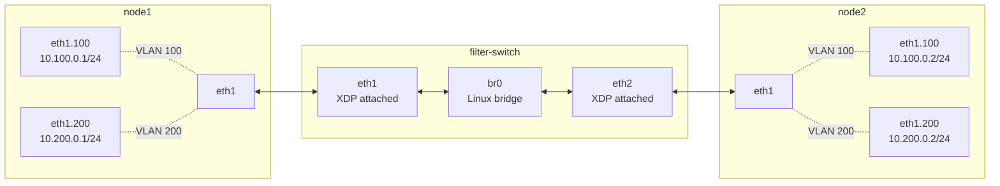
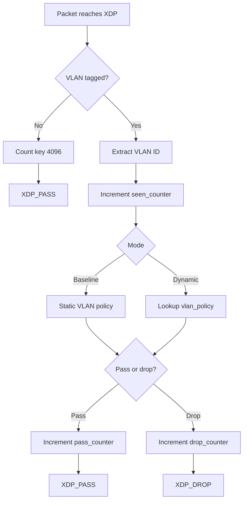

# XDP/eBPF VLAN Policy Filter

## Overview

This repository is a Containerlab-based networking lab that demonstrates VLAN policy enforcement with XDP/eBPF. The lab uses three Linux containers: `node1`, `filter-switch`, and `node2`. The middle `filter-switch` node acts as a Linux bridge and enforcement point, with XDP attached on both bridge-facing interfaces.

The project demonstrates three practical eBPF capabilities:

- Static VLAN filtering.
- Per-VLAN packet counters using BPF maps.
- Runtime VLAN policy control from user space.

The main goal is to show how an XDP data-plane program can stay loaded while user space changes VLAN pass/drop behavior through BPF maps, without rebuilding the BPF program and without reattaching XDP.

## Environment

The lab was validated on VBox Ubuntu 24.04. WSL can be used for editing, Git, and documentation, but runtime validation should be done in a real Linux environment with BPF/XDP support.

| Requirement | Purpose |
|---|---|
| Linux with BPF/XDP support | Runtime environment |
| Docker | Lab containers |
| Containerlab | Topology creation |
| `bpftool` | Load programs, inspect XDP attachment, inspect maps, read counters |
| clang/LLVM or the provided build helper | Compile BPF C programs into BPF object files |
| Privileged/container networking support | Required for interfaces, VLANs, bridges, bpffs, and XDP attach |

The scripts assume the system can create network namespaces, Linux bridges, VLAN interfaces, and pinned BPF objects under `/sys/fs/bpf`.

## Project Levels

| Level | Feature | Status |
|---|---|---|
| Level 1 | Static XDP VLAN filtering | Implemented |
| Level 2 | Per-VLAN BPF counters | Implemented |
| Level 3 | Runtime user-space VLAN policy control | Implemented |

Level 1 is the baseline static mode: VLAN 100 passes, VLAN 200 drops, other tagged VLANs drop, and untagged traffic passes.

Level 2 adds counters that track packets seen, passed, and dropped per VLAN key.

Level 3 adds dynamic mode, where user space can block or allow VLANs through a pinned BPF hash map without rebuilding the program and without reattaching XDP.

## Topology

The lab uses a three-node topology. `node1` and `node2` generate VLAN-tagged traffic, while `filter-switch` acts as the Linux bridge and XDP enforcement point.


```mermaid
flowchart LR
    subgraph N1[node1]
        N1E[eth1]
        N1100[eth1.100<br/>10.100.0.1/24]
        N1200[eth1.200<br/>10.200.0.1/24]
    end

    subgraph FS[filter-switch]
        F1[eth1<br/>XDP attached]
        BR[br0<br/>Linux bridge]
        F2[eth2<br/>XDP attached]
    end

    subgraph N2[node2]
        N2E[eth1]
        N2100[eth1.100<br/>10.100.0.2/24]
        N2200[eth1.200<br/>10.200.0.2/24]
    end

    N1100 -. VLAN 100 .- N1E
    N1200 -. VLAN 200 .- N1E
    N1E <--> F1
    F1 <--> BR
    BR <--> F2
    F2 <--> N2E
    N2E -. VLAN 100 .- N2100
    N2E -. VLAN 200 .- N2200
```

`filter-switch` is the enforcement point. XDP is attached on both bridge-facing interfaces, so packets are checked before normal Linux bridge forwarding and the policy is applied in both directions.

## Modes

| Mode | BPF program | Attach script | Policy |
|---|---|---|---|
| Baseline static | `src/vlan_filter.bpf.c` | `scripts/attach-xdp.sh` | VLAN 100 passes; VLAN 200 and other tagged VLANs drop. |
| Dynamic policy | `src/vlan_filter_dynamic.bpf.c` | `scripts/attach-xdp-dynamic.sh` | Missing key passes; `0` drops; `1` passes. |

Only one XDP program is attached to each interface at a time. Running one of the attach scripts switches the lab to that mode.

Example dynamic policy update:

```bash
./scripts/vlan-policy.sh block 400
```

This updates the live dynamic policy map while the XDP program remains attached.

## Quick Start

Run all commands from the repository root in the Linux validation environment.

### 1. Build BPF Programs

```bash
make -C src
```

This builds both BPF object files:

```text
src/vlan_filter.bpf.o
src/vlan_filter_dynamic.bpf.o
```

### 2. Deploy the Lab

```bash
./scripts/deploy.sh
```

This builds the lab image and deploys the three-node Containerlab topology.

### 3. Run Baseline Mode

```bash
./scripts/attach-xdp.sh
./scripts/test.sh
./scripts/show-stats.sh
```

Expected result:

```text
VLAN 100 passes
VLAN 200 drops
Counters show VLAN 100 pass traffic and VLAN 200 drop traffic
```

Check XDP attachment:

```bash
docker exec clab-xdp-vlan-policy-filter-filter-switch bpftool net
```

### 4. Run Dynamic Mode

```bash
./scripts/attach-xdp-dynamic.sh
./scripts/validate-dynamic-policy.sh
```

Expected result:

```text
VLAN 200 starts blocked
VLAN 200 can be changed to pass from user space
VLAN 200 can be changed back to block
The dynamic XDP program stays attached during policy changes
```

### 5. Manual Dynamic Policy Control

```bash
./scripts/vlan-policy.sh block 400
./scripts/vlan-policy.sh pass 400
./scripts/vlan-policy.sh show 400
./scripts/vlan-policy.sh list blocked
./scripts/vlan-policy.sh list all
```

Aliases are also supported:

```text
drop  = block
allow = pass
```

## How It Works

The XDP program receives each packet through the `xdp_md` context before normal Linux bridge forwarding. It reads the Ethernet header only after verifier-safe bounds checks.

If the EtherType is `0x8100` for 802.1Q or `0x88a8` for 802.1AD, the program reads the VLAN header and extracts the VLAN ID from the lower 12 bits of the VLAN TCI field.

Untagged traffic is counted under key `4096`, which is outside the valid VLAN ID range `0..4095`, and is passed. Tagged traffic is counted under its VLAN ID.

Baseline mode applies a static allowlist policy. Dynamic mode looks up the VLAN ID in the `vlan_policy` hash map and applies the user-space controlled policy. The counters record the final decision; they do not make the forwarding decision.


```mermaid
flowchart TD
    A[Packet reaches XDP] --> B{VLAN tagged?}
    B -- No --> C[Count key 4096]
    C --> D[XDP_PASS]
    B -- Yes --> E[Extract VLAN ID]
    E --> F[Increment seen_counter]
    F --> G{Mode}
    G -- Baseline --> H[Static VLAN policy]
    G -- Dynamic --> I[Lookup vlan_policy]
    H --> J{Pass or drop?}
    I --> J
    J -- Pass --> K[Increment pass_counter]
    J -- Drop --> L[Increment drop_counter]
    K --> M[XDP_PASS]
    L --> N[XDP_DROP]
```

The filter is VLAN-based, not IP-based. The validation uses IPv4 ping because it is simple to observe, but the XDP decision is made at Layer 2 before the payload protocol matters.

## BPF Maps

| Map | Mode | Type | Purpose |
|---|---|---|---|
| `seen_counter` | both | `BPF_MAP_TYPE_PERCPU_ARRAY` | Counts packets classified by VLAN or untagged key |
| `pass_counter` | both | `BPF_MAP_TYPE_PERCPU_ARRAY` | Counts packets passed by the policy |
| `drop_counter` | both | `BPF_MAP_TYPE_PERCPU_ARRAY` | Counts packets dropped by the policy |
| `vlan_policy` | dynamic | `BPF_MAP_TYPE_HASH` | Runtime VLAN pass/drop policy controlled from user space |

Counter keys used by both modes:

| Key | Meaning |
|---:|---|
| `100` | VLAN 100 traffic |
| `200` | VLAN 200 traffic |
| `4096` | Untagged traffic |

Dynamic policy map path:

```text
/sys/fs/bpf/xdp_vlan_dynamic/vlan_policy
```

Dynamic policy semantics:

| Policy state | Meaning |
|---|---|
| Missing key | Pass by default |
| `0` | Block/drop |
| `1` | Pass/allow |
| Invalid explicit value | Drop/fail closed |

`seen_counter`, `pass_counter`, and `drop_counter` are per-CPU arrays. Each CPU updates its own local value in the XDP fast path. `scripts/show-stats.sh` reads the pinned maps with `bpftool -j` and uses `jq` to sum per-CPU values.

For dynamic mode counters, use:

```bash
BPF_MAP_DIR=/sys/fs/bpf/xdp_vlan_dynamic ./scripts/show-stats.sh
```

## Validation Proof

### Baseline Proof

Baseline mode was validated after attaching `src/vlan_filter.bpf.o`.

Observed behavior:

```text
VLAN 100 ping passed
VLAN 200 ping dropped
XDP attached on filter-switch eth1 and eth2
```

Counter example:

```text
VLAN 100     seen=13       pass=13       drop=0
VLAN 200     seen=6        pass=0        drop=6
untagged     seen=2        pass=2        drop=0
```

### Dynamic Proof

Dynamic mode was validated after attaching `src/vlan_filter_dynamic.bpf.o`.

Observed behavior:

```text
VLAN 200 started blocked
./scripts/vlan-policy.sh pass 200 changed VLAN 200 to explicitly allowed
VLAN 200 ping passed
./scripts/vlan-policy.sh block 200 changed VLAN 200 back to blocked
VLAN 200 ping dropped
```

The same dynamic XDP program stayed attached during the policy changes:

```text
112: xdp name xdp_vlan_filter_dynamic tag c5ca799d563bf848
```

Dynamic counter example:

```text
VLAN 100     seen=10       pass=10       drop=0
VLAN 200     seen=21       pass=8        drop=13
untagged     seen=4        pass=4        drop=0
```

This proves that VLAN behavior changed from user space while the XDP program stayed loaded.

### Policy Controller Proof

The user-space policy controller was also tested for repeated operations and multiple entries:

```text
VLAN 400 changed from allowed by default to blocked
Repeating block 400 reported VLAN 400 was already blocked
VLAN 400 changed from blocked to explicitly allowed
Repeating pass 400 reported VLAN 400 was already explicitly allowed
list blocked showed VLAN 200, VLAN 300, and VLAN 500
list all showed VLAN 200 blocked, VLAN 300 blocked, VLAN 400 explicitly allowed, and VLAN 500 blocked
```

Baseline validation logs are stored under `results/logs/`. The dynamic validation output is summarized above; separate dynamic log files can be added under `results/logs/` if persistent evidence is needed.

## Repository Structure

This tree shows the clean tracked repository structure. Runtime files created by Containerlab and BPF build artifacts are generated locally and are intentionally ignored by Git.

```text
.
├── Dockerfile
├── README.md
├── bpf-builder/
│   └── Dockerfile
├── containerlab/
│   ├── xdp-vlan-policy-filter.clab.yml
│   ├── bin/
│   │   └── entrypoint.sh
│   └── configs/
│       ├── filter-switch.cfg
│       ├── node1.cfg
│       └── node2.cfg
├── results/
│   └── logs/
│       ├── final-bpftool-net.log
│       ├── final-stats.log
│       └── final-test.log
├── scripts/
│   ├── build-bpf.sh
│   ├── deploy.sh
│   ├── attach-xdp.sh
│   ├── attach-xdp-dynamic.sh
│   ├── test.sh
│   ├── validate-dynamic-policy.sh
│   ├── vlan-policy.sh
│   ├── show-stats.sh
│   └── destroy.sh
└── src/
    ├── Makefile
    ├── vlan_filter.bpf.c
    └── vlan_filter_dynamic.bpf.c
```

Generated files such as the following are created during build or deployment and are not part of the clean repository tree:

```text
src/vmlinux.h
src/*.bpf.o
containerlab/clab-*
```

## Engineering Notes

- XDP is attached on both `filter-switch` ports so policy enforcement is symmetric across the bridge.
- VLAN offload and header reordering matter because VLAN tags must be visible to the XDP parser.
- MTU is fixed at 1500 across the lab to avoid virtual interface mismatch issues.
- Per-CPU maps reduce counter contention in the XDP fast path.
- `bpftool -j` and `jq` are used to read pinned maps and produce readable counter and policy output.
- Dynamic mode pins its maps under `/sys/fs/bpf/xdp_vlan_dynamic` to avoid confusion with baseline mode maps.

## Troubleshooting

| Issue | Likely cause | Fix |
|---|---|---|
| Stale lab containers | Previous Containerlab run was not cleaned up. | Run `./scripts/destroy.sh`, then deploy again. |
| XDP is not attached | Attach script was not run or failed. | Run the appropriate attach script and check `bpftool net`. |
| Counters are missing | Maps are not pinned or the wrong map directory is being read. | Attach XDP first; for dynamic stats use `BPF_MAP_DIR=/sys/fs/bpf/xdp_vlan_dynamic ./scripts/show-stats.sh`. |
| Dynamic policy map not found | Dynamic mode is not attached. | Run `./scripts/attach-xdp-dynamic.sh` before `./scripts/vlan-policy.sh`. |
| VLAN tags are not classified | VLAN offload or header reordering may hide tags from XDP. | Check the offload/reorder setup in `containerlab/bin/entrypoint.sh` and redeploy cleanly. |

## Cleanup

```bash
./scripts/destroy.sh
```
